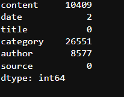
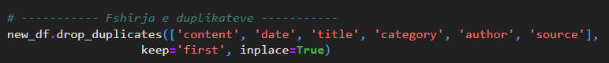

# Parashikimi i kategorisë së artikujve të lajmeve në gjuhën shqipe

## Informacione mbi projektin

Ky projekt është zhvilluar si pjesë e programit akademik në Universitetin e Prishtinës "Hasan Prishtina", Fakullteti i Inxhinieris elektrike dhe kompjuterike, në kuadër të nivelit të studimeve Master. Projekti është përgatitur për lëndën Machine Learning, e udhëhequr nga profesorët Lule Ahmedi dhe asistentit Mërgim Hoti.

## Përshkrimi i Projektit

Qëllimi i këtij projekti është të zhvillohet një model i mësimit të makinës që mund të parashikojë me saktësi kategorinë e artikujve të lajmeve në gjuhën shqipe. Për të arritur këtë qëllim, është përdorur dataseti i artikujve të lajmeve nga Kosova, i disponueshëm në **[Albanian News Articles Dataset](https://www.kaggle.com/datasets/gentrexha/kosovo-news-articles-dataset)** në platformën Kaggle.

Modeli synon të klasifikojë artikujt në kategori të ndryshme si Shëndeti, Sporti, Politika, etj., duke përdorur përmbajtjen tekstuale të artikullit. Kjo do të mundësojë klasifikimin automatik të artikujve të lajmeve në portale të ndryshme informative, duke ndihmuar në organizimin më efikas të tyre dhe ofrimin e përmbajtjeve më relevante për lexuesit.

## Startimi i projektit
1. Se pari bëni instalimin e python-it në pajisjen e juaj.
2. Klonimi i projektit:  **[Albanian News Articles Dataset](https://www.kaggle.com/datasets/gentrexha/kosovo-news-articles-dataset)**.
3. Ekzekutimi i komandës për instalimin e librarive në direktoriumin ku është i vendosur projekti:
```python
pip3 install -r requirements.txt
```

## Tipet e atributeve
1. Kategoriale(Kualitative)
    - Nominale: 'content', 'title', 'category', 'author', 'source'
2. Numerike(Kuantitative)
    - Interval: 'date'
## Faza I:  Përgatitja e modelit
### 1. *Kualiteti i të dhënave*: 
#### 1.1 *Menaxhimi vlerave *null**: 
- Në dataset-in tonë janë gjetur disa lloje të ndryshme të kolonave me vlera *null*.


- Vlerat *null* të kolonave "date, category & author" i kemi injoruar.

#### 1.2 *Menaxhimi i duplikateve*: 
- Në dataset-in tonë i janë gjetur 613866 duplikate.
- Pas ekzektuimi të komandës për gjetjen e rreshtave duplikat e kemi ekzekutuar komandën për largimin e duplikateve.



### 2. Priprocesimi i të dhënave: 

## Kontributi
Blerona Idrizi

Ariana Gashi