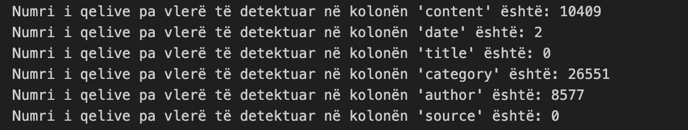
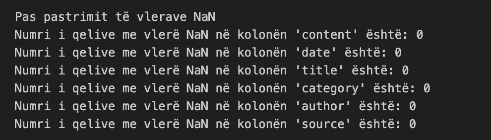
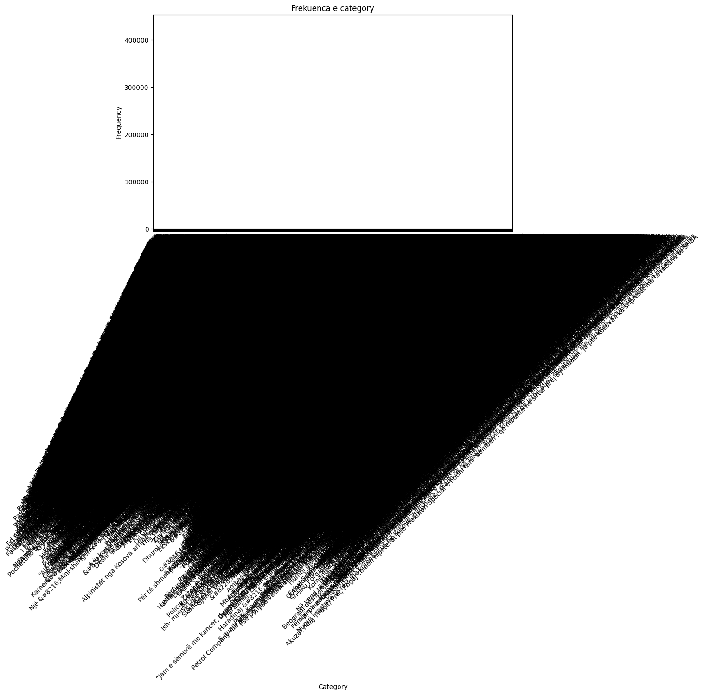
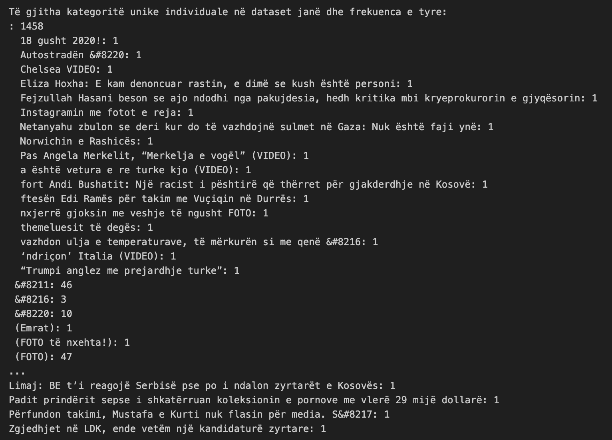
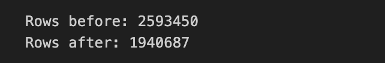
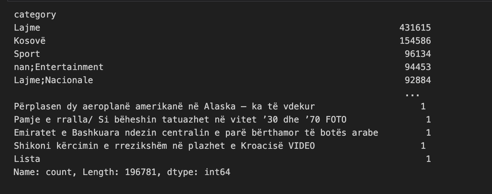
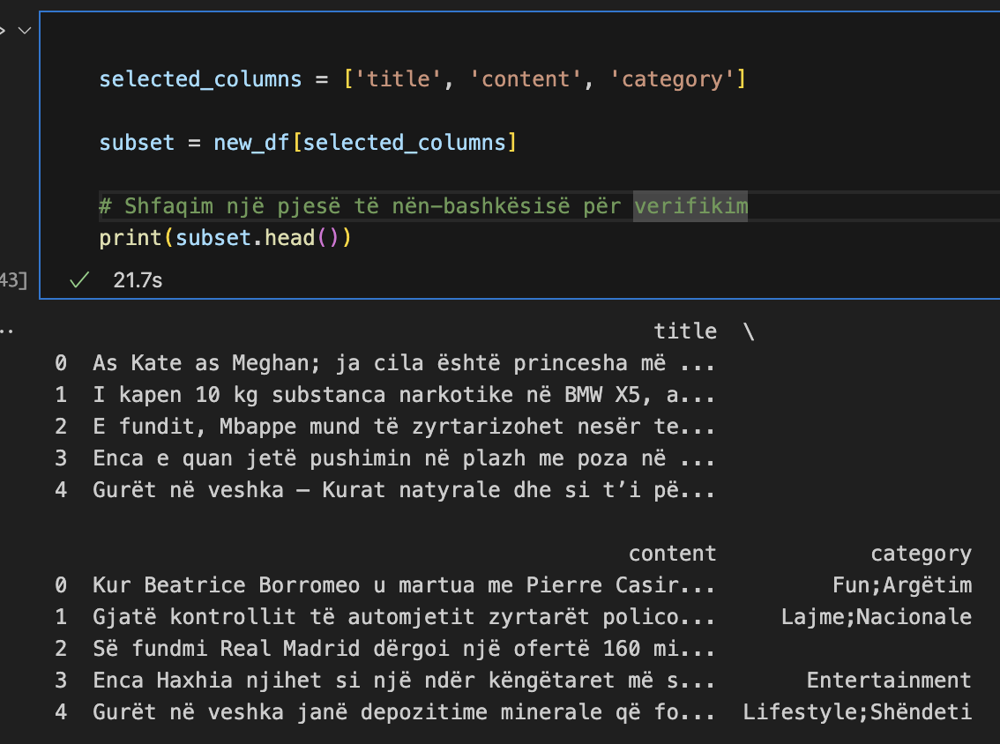
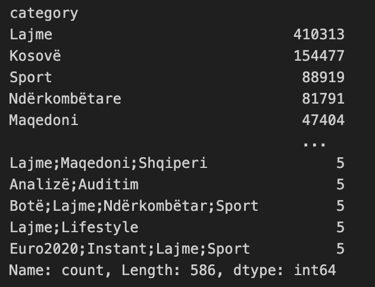
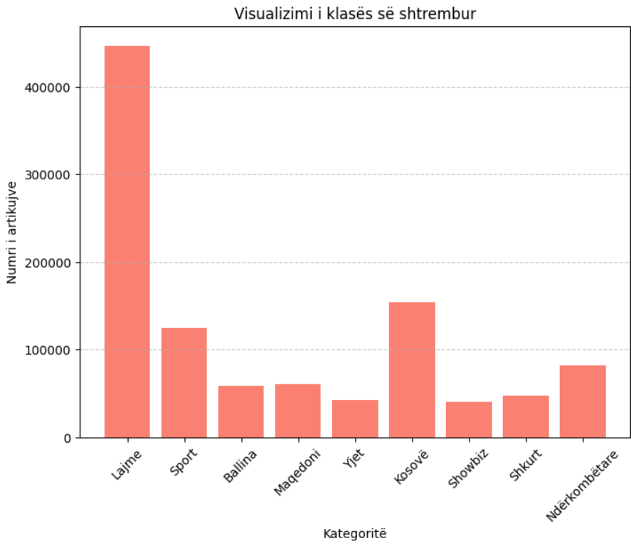

# Parashikimi i kategorisë së artikujve të lajmeve në gjuhën shqipe

Ky projekt është zhvilluar si pjesë e programit akademik në Universitetin e Prishtinës "Hasan Prishtina", Fakullteti i Inxhinieris Elektrike dhe Kompjuterike, në kuadër të nivelit të studimeve Master. Projekti është përgatitur për lëndën Machine Learning, e udhëhequr nga profesoresha Lule Ahmedi dhe asistenti Mërgim Hoti.

Qëllimi i këtij projekti është të zhvillohet një model i mësimit të makinës që mund të parashikojë me saktësi kategorinë e artikujve të lajmeve në gjuhën shqipe. Për të arritur këtë qëllim, është përdorur dataseti i artikujve të lajmeve nga Kosova, i disponueshëm në **[Albanian News Articles Dataset](https://www.kaggle.com/datasets/gentrexha/kosovo-news-articles-dataset)** në platformën Kaggle.

Modeli synon të klasifikojë artikujt në kategori të ndryshme si Shëndeti, Sporti, Politika, etj., duke përdorur përmbajtjen tekstuale të artikullit. Kjo do të mundësojë klasifikimin automatik të artikujve të lajmeve në portale të ndryshme informative, duke ndihmuar në organizimin më efikas të tyre dhe ofrimin e përmbajtjeve më relevante për lexuesit.

## Detajet e datasetit

Dataseti i përdorur në këtë projekt përmban artikuj të lajmeve nga Kosova, të cilët janë të shkruar në gjuhën shqipe. Ky dataset është i disponueshëm në platformën Kaggle dhe mund të aksesohet përmes linkut të mëposhtëm:

[Albanian News Articles Dataset](https://www.kaggle.com/datasets/gentrexha/kosovo-news-articles-dataset)

Karakteristikat kryesore të datasetit përfshijnë:
- **Kolonat e dataset-it:** Dataseti përmban këto kolona: 'content', 'date', 'title', 'category', 'author', 'source'.
- **Numri i atributeve:** Dataseti ynë përbëhet nga 6 kolona dhe më shumë se 3 milion rreshta.
- **Madhësia e datasetit:** Dataseti ka një madhësi prej 3.85 GB.
- **Tipet e atributeve:**
    1. Kategoriale(Kualitative)
        - Nominale: 'content', 'title', 'category', 'author', 'source'
    2. Numerike(Kuantitative)
        - Interval: 'date'
- **Burimi:** Dataseti është krijuar dhe mbledhur nga Gent Rexha dhe është publikuar në Kaggle për përdorim në projekte të ndryshme të mësimit të makinës.

Ju lutemi referojuni dokumentacionit të datasetit në Kaggle për detaje të mëtejshme dhe udhëzime rreth përdorimit të tij.

## Struktura e projektit
- `data-preparation-and-visualization/main.ipynb`: Skriptë e python për ekzekutimin e komandave të dëshiruara.
- `utils.py`: Skriptë që përmban funksione ndihmëse të përdorura në skriptat e tjera.
- `files/`: Direktoria ku ruhen fajllat e dataseteve të përdorura në projekt.
- `images/`: Direktoria ku ruhen imazhet e përdorura në projekt.
- `requirements.txt`: Direktoria ku ruhen libraritë e përdorura.
- `README.md`: Ky dokument, i cili përmban informacionet bazë të projektit.

## Teknologjitë e përdorura
Gjuha kryesore e programimit për zhvillimin e modelit është python ku libraritë e përdorura gjenden ne fajllin requirements.txt në mënyrë që me atë fajll mund të instalohen libraritë e nevojshme për këtë projekt.
Disa nga algoritmet e klasifikimit qe pretendojm ti perdorim që të gjejmë se cili na pershtatet dhe na rezulton me rezultate me të mira janë:
```python
1. Logistic Regression
2. Decision Tree
3. Random Forest
4. Naive Bayes
5. K-Nearest Neighbors (KNN)
```

## Startimi i projektit
1. Se pari bëni instalimin e python-it në pajisjen e juaj.
2. Klonimi i projektit:  **[Albanian News Articles Dataset](https://www.kaggle.com/datasets/gentrexha/kosovo-news-articles-dataset)**.
3. Ekzekutimi i komandës për instalimin e librarive në direktoriumin ku është i vendosur projekti:
```python
pip3 install -r requirements.txt
```

## Faza I:  Përgatitja e modelit
#### 1. *Menaxhimi vlerave *null**: 
- Në dataset-in tonë janë gjetur disa lloje të ndryshme të kolonave me vlera *null*.


- Vlerat *null* të kolonave "date, category & author" i kemi injoruar.

#### 2. *Menaxhimi i duplikateve*: 
- Në dataset-in tonë i janë gjetur 613866 duplikate.
- Pas ekzektuimi të komandës për gjetjen e rreshtave duplikat e kemi ekzekutuar komandën për largimin e duplikateve.


#### 3. *Menaxhimi i NaN vlerave*: 
Në dataset-in tonë janë gjendur vlera NaN në kolonat e ndryshme dhe i kemi fshire ato.
- Para:


- Pas:



#### 3. *Largimi i kolonave*: 
Në dataset-in tonë janë larguar kolonat: 'date' dhe 'author', për shkak se nuk janë të nevojshme në parashikimin e kategorisë, bazuar në kontent.

#### 3. *Menagjimi i Outliers-ave*: 
Paraqitja e Outliers ne baze te kolonës category:



Pas këtij grafikoni shohim se kategoritë nuk janë të ndara në rregull dhe kemi filluar analizimin e tyre. Ne kemi mbledhur të gjitha kategoritë dhe i kemi ruajtu në fajllin all_categories.txt për ti analizuar ato. Në fajll shohim se në kolonë kategori ka mungesë të saktësis së të dhënave:



Më pas i kemi larguar të gjitha kategoritë të cilat nuk janë përdorur saktë, dhe nga 2593450 rreshta të datasetit pas pastrimit është fituar ky rezultat:


Pastrimi i datasetit duket si më poshtë: 



- *Në këtë rast shohim kolonën category të pastruar me vlerat që përdoren më shumë se 5 here në dataset.*.

#### 4. *Krijimi i nënbashkësive*: 
Shembulli i një nënbashkësie të të dhënave te kolonave: 'title', 'content', 'category'



#### 5. *Agregimi*: 
Paraqitja e një shembulli të agregimit - grumbullimi i të dhënave category se sa janë përdorur.



#### 5. *Të dhënat e shtrembura*
Për paraqitja e një shembulli të të dhëave të shtrembura për kolonën **'category'** ne kemi numëruar kategoritë unike dhe kemi llogaritur totalin e artikujve që e posedojnë atë kategori. Identifikimi i klasëve të shtrembura është bërë përmes kriterit të fjalëve që kanë numër më të madh të paraqitjeve krahasuar me mesataren e përgjithshme dhe devijimin standard. 
Përmes histogramit mund të shihet se cilat kategori janë më të përhapurat në të dhënat tona.



## Kontributi
Blerona Idrizi

Ariana Gashi