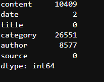
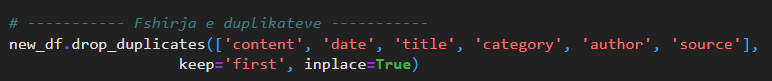

# Parashikimi i Kategorisë së Artikujve të Lajmeve në Gjuhën Shqipe

Ky projekt synon të zhvillojë një model të mësimit të makinës për të parashikuar kategorinë e një artikulli të lajmit në gjuhën shqipe. Për këtë qëllim, do të përdorim datasetin e artikujve të lajmeve të Kosovës të disponueshëm në **[Albanian News Articles Dataset](https://www.kaggle.com/datasets/gentrexha/kosovo-news-articles-dataset)**.


Qëllimi kryesor i këtij projekti është të ndërtojmë një model të mësimit të makinës që mund të parashikojë kategorinë e një artikulli të lajmit me bazë tekstin e artikullit. Kategoritë e mundshme të artikujve përfshijnë Shëndeti, Sport, Politikë, etj. Kjo mund të përdoret për të klasifikuar automatikisht artikujt e lajmeve në faqet e internetit, për të ndihmuar në organizimin e tyre dhe për të ofruar përmbajtje relevante për audiencën.


## Startimi i projektit
1. Se pari bëni instalimin e python-it në pajisjen e juaj.
2. Klonimi i projektit:  **[Albanian News Articles Dataset](https://www.kaggle.com/datasets/gentrexha/kosovo-news-articles-dataset)**.
3. Ekzekutimi i komandës për instalimin e librarive në direktoriumin ku është i vendosur projekti:
```python
pip3 install -r requirements.txt
```

## Tipet e atributeve
1. Kategoriale(Kualitative)
    - Nominale: Kategoria, Titulli, Autori, Përmbajtja, Burimi i artikullit
2. Numerike(Kuantitative)
    - Interval: Data e publikimit.


    ## Disa rezultate tona në priprocesimin e të dhënave
### 1. *Kualiteti i të dhënave*: 
#### 1.1 *Menaxhimi vlerave *null**: 
- Në dataset-in tonë janë gjetur disa lloje të ndryshme të kolonave me vlera *null*.


- Vlerat *null* të kolonave "date, category & author" i kemi injoruar.

#### 1.2 *Menaxhimi i duplikateve*: 
- Në dataset-in tonë i janë gjetur 613866 duplikate.
- Pas ekzektuimi të komandës për gjetjen e rreshtave duplikat e kemi ekzekutuar komandën për largimin e duplikateve.



### 2. Priprocesimi i të dhënave: 
