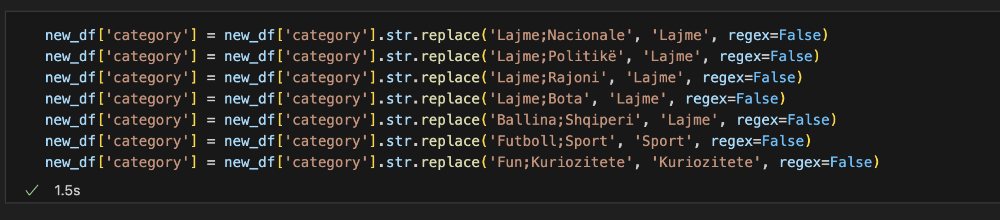
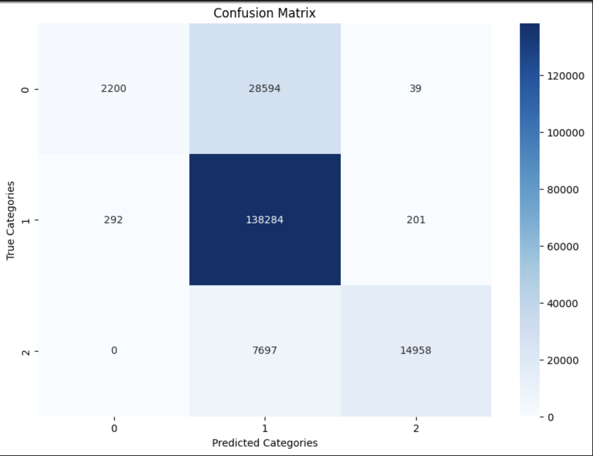
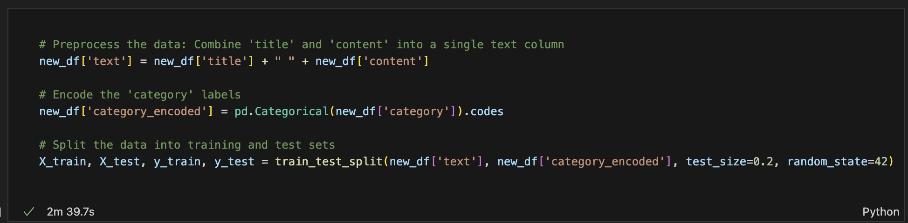

# Parashikimi i kategorisë së artikujve të lajmeve në gjuhën shqipe

Ky projekt është zhvilluar si pjesë e programit akademik në Universitetin e Prishtinës "Hasan Prishtina", Fakullteti i Inxhinieris Elektrike dhe Kompjuterike, në kuadër të nivelit të studimeve Master. Projekti është përgatitur për lëndën Machine Learning, e udhëhequr nga profesoresha Lule Ahmedi dhe asistenti Mërgim Hoti.

Qëllimi i këtij projekti është të zhvillohet një model i mësimit të makinës që mund të parashikojë me saktësi kategorinë e artikujve të lajmeve në gjuhën shqipe. Për të arritur këtë qëllim, është përdorur dataseti i artikujve të lajmeve nga Kosova, i disponueshëm në **[Albanian News Articles Dataset](https://www.kaggle.com/datasets/gentrexha/kosovo-news-articles-dataset)** në platformën Kaggle.

Modeli synon të klasifikojë artikujt në kategori të ndryshme si Shëndeti, Sporti, Politika, etj., duke përdorur përmbajtjen tekstuale të artikullit. Kjo do të mundësojë klasifikimin automatik të artikujve të lajmeve në portale të ndryshme informative, duke ndihmuar në organizimin më efikas të tyre dhe ofrimin e përmbajtjeve më relevante për lexuesit.

## Detajet e datasetit

Dataseti i përdorur në këtë projekt përmban artikuj të lajmeve nga Kosova, të cilët janë të shkruar në gjuhën shqipe. Ky dataset është i disponueshëm në platformën Kaggle dhe mund të aksesohet përmes linkut të mëposhtëm:

[Albanian News Articles Dataset](https://www.kaggle.com/datasets/gentrexha/kosovo-news-articles-dataset)

Karakteristikat kryesore të datasetit përfshijnë:
- **Kolonat e dataset-it:** Dataseti përmban këto kolona: 'content', 'date', 'title', 'category', 'author', 'source'.
- **Numri i atributeve:** Dataseti ynë përbëhet nga 6 kolona dhe më shumë se 3 milion rreshta.
- **Madhësia e datasetit:** Dataseti ka një madhësi prej 3.85 GB.
- **Tipet e atributeve:**
    1. Kategoriale(Kualitative)
        - Nominale: 'content', 'title', 'category', 'author', 'source'
    2. Numerike(Kuantitative)
        - Interval: 'date'
- **Burimi:** Dataseti është krijuar dhe mbledhur nga Gent Rexha dhe është publikuar në Kaggle për përdorim në projekte të ndryshme të mësimit të makinës.

Ju lutemi referojuni dokumentacionit të datasetit në Kaggle për detaje të mëtejshme dhe udhëzime rreth përdorimit të tij.

## Struktura e projektit
- `data-preparation-and-visualization/main.ipynb`: Skriptë e python që paraqet fazën e parë të detyrës - .
- `files/`: Direktoria ku ruhen fajllat e dataseteve të përdorura në projekt.
- `images/`: Direktoria ku ruhen imazhet e përdorura në projekt.
- `requirements.txt`: Direktoria ku ruhen libraritë e përdorura.
- `README.md`: Ky dokument, i cili përmban informacionet bazë të projektit.

## Teknologjitë e përdorura
Gjuha kryesore e programimit për zhvillimin e modelit është python ku libraritë e përdorura gjenden ne fajllin requirements.txt në mënyrë që me atë fajll mund të instalohen libraritë e nevojshme për këtë projekt.
Disa nga algoritmet e klasifikimit qe pretendojm ti perdorim që të gjejmë se cili na pershtatet dhe na rezulton me rezultate me të mira janë:
```python
1. Logistic Regression
2. Decision Tree
3. Random Forest
4. Naive Bayes
5. K-Nearest Neighbors (KNN)
```

## Startimi i projektit
1. Se pari bëni instalimin e python-it në pajisjen e juaj.
2. Klonimi i projektit:  **[Albanian News Articles Dataset](https://www.kaggle.com/datasets/gentrexha/kosovo-news-articles-dataset)**.
3. Ekzekutimi i komandës për instalimin e librarive në direktoriumin ku është i vendosur projekti:
```python
pip3 install -r requirements.txt
```

## Përgatitja e modelit
#### 1. *Menaxhimi vlerave *null**: 
- Në dataset-in tonë janë gjetur disa lloje të ndryshme të kolonave me vlera *null*.


- Vlerat *null* të kolonave "date, category & author" i kemi injoruar.

#### 2. *Menaxhimi i duplikateve*: 
- Në dataset-in tonë i janë gjetur 613866 duplikate.
- Pas ekzektuimi të komandës për gjetjen e rreshtave duplikat e kemi ekzekutuar komandën për largimin e duplikateve.


#### 3. *Menaxhimi i NaN vlerave*: 
Në dataset-in tonë janë gjendur vlera NaN në kolonat e ndryshme dhe i kemi fshire ato.
- Para:


- Pas:


#### 3. *Largimi i kolonave*: 
Në dataset-in tonë janë larguar kolonat: 'date' dhe 'author', për shkak se nuk janë të nevojshme në parashikimin e kategorisë, bazuar në kontent.

#### 3. *Menagjimi i Outliers-ave*: 
Paraqitja e Outliers ne baze te kolonës category:


Pas këtij grafikoni shohim se kategoritë nuk janë të ndara në rregull dhe kemi filluar analizimin e tyre. Ne kemi mbledhur të gjitha kategoritë dhe i kemi ruajtu në fajllin all_categories.txt për ti analizuar ato. Në fajll shohim se në kolonë kategori ka mungesë të saktësis së të dhënave:


Më pas i kemi larguar të gjitha kategoritë të cilat nuk janë përdorur saktë, dhe nga 2593450 rreshta të datasetit pas pastrimit është fituar ky rezultat:


Pastrimi i datasetit duket si më poshtë: 


- *Në këtë rast shohim kolonën category të pastruar me vlerat që përdoren më shumë se 5 here në dataset.*.

#### 4. *Krijimi i nënbashkësive*: 
Shembulli i një nënbashkësie të të dhënave te kolonave: 'title', 'content', 'category'


#### 5. *Agregimi*: 
Paraqitja e një shembulli të agregimit - grumbullimi i të dhënave category se sa janë përdorur.


#### 5. *Të dhënat e shtrembura*
Për paraqitja e një shembulli të të dhëave të shtrembura për kolonën **'category'** ne kemi numëruar kategoritë unike dhe kemi llogaritur totalin e artikujve që e posedojnë atë kategori. Identifikimi i klasëve të shtrembura është bërë përmes kriterit të fjalëve që kanë numër më të madh të paraqitjeve krahasuar me mesataren e përgjithshme dhe devijimin standard. 
Përmes histogramit mund të shihet se cilat kategori janë më të përhapurat në të dhënat tona.


#### 6. *Detektimi dhe trajtimi i vlerave të jashtme (Outliers)*
Për identifikimin e outliers, ne kemi implementuar algoritmin KMeans. Pas zbatimit të KMeans, grupi që përmbante numrin më të vogël të rasteve u konsiderua si përmbajtja e vlerave të jashtme. Heqja e outliers mund të kontribuojë në përmirësimin e performancës së modelit duke ulur ndikimin e zhurmës dhe duke mundësuar një përshkrim më të saktë të tendencave në të dhëna. Kjo u verifikua nëpërmjet krahasimit të performancës së modelit para dhe pas trajtimit të vlerave të jashtme.

- Ne gjetëm se pas heqjes së vlerave të jashtme, modeli ynë tregoi një përmirësim në saktësi, që sugjeron se këto raste të rralla po e shtrembëronin mësimin e modelit. Numri specifik i anomalive të detektuara dhe ndikimi i tyre në model janë të dokumentuara në raportet e analizës.


#### 6. *Mostrimi*
Paraqitja e outliers me mostrim:


## Faza II: Trajnimi i modelit

#### 1. *Riprocesimi i dataset-it*
 - Kontrollimi i kategorive

Së pari i kemi shikur edhe njëherë se sa kategori janë përdorur në dataset-in tonë.


##### Eleminimi i kategorive

Sic shihet në figurën e mësiperme dhe poashtu pasi që në SMOTE kemi pasur vlera të njëanshme ne kemi vendosur ti heqim kategoritë të cilat janë përdorur më pak dhe që perdorën në dataset-in tonë me një numer të vogel vlerash. Në figurën e mëposhtme kemi detaje më të hollësishme në lidhje me kategoritë e eleminuara.


##### Kontrollimi i kategorive pas heqjes së disa kategorive

Ne i kemi kontrolluar përseri numrin e përgjithshëm të kategorive që janë përdorur:


Ne kemi pare se në kolonën category ente kane mbetur disa kategori si dy kategori të ndara me ";", kështu që kemi vendosur ti bëjmë këto zevendësime:



##### Kategoritë pas eleminimit

Pasi që i kemi eleminuar disa kategori dhe kemi maipuluar me to, numri i kolonace në bazë të kategorive duket kështu:


##### Rikontrollimi i kategorive

Sipas rezultateve të fundit ne shohim se kategoritë e përdorura me pak se 100k rreshta janë vlera të vogla përkunder vlearve të përdorura si Lajme apo Kosovë dhe kështu qe ne i kemi reduktuar ato dhe rezultati final i kategorive pas riprocesimit duket kështu:


#### 2. *Reduktimi i të dhënave*
Pas riprocesimit ende kemi shumë vlera në kategori dhe ekzekutimi i kodit për algoritme merr me orë të tëra, kështu qe ne kemi vendosur ti marrim vetem 1/4 e datasetit dhe ta ruajmë në fajllin: Reduced_Preprocessed_Kosovo_News_Articles_Dataset.csv


#### 2. *Confusion Matrix*
Para fillimit të ekzekutimit të algoritme kemi dashur ti shohim raportin e klasifikimit të datasetit tonë me Confusion Matrix. Në figurën e mëposhtme shfaqet confusion matrix e total datasetit:



Pasi që kuptimi i confusion matrix është shumë më i vështirë për komplet datasetin, ne i kemi shfaqur vlerat e confusion matrix për secilën tip të kategorive. Një shembull duket kështu:


Raporti i klasisfikimit para ekzekutimit të algoritmeve ka këto vlera: 


#### 3. *Ndarja e train/test dataset-it*

Kjo pjesë paraqet përpunimin e të dhënat tekstuale për përdorim në modele të klasifikimit të tekstit. Ne kemi kombinuar kolonat: content dhe title në një kolonë të vetme, që kodon kategoritë në forma numerike, dhe ndan të dhënat në grupe trajnimi dhe testim për të vlerësuar performancën e modelit.



#### 4. *Algoritmet e aplikuara*

Ne kemi vendosu që ti ekzekutojmë këto algoritme:

##### 4.1 *BERT (Bidirectional Encoder Representations from Transformers)*
BERT është një model i avancuar për procesimin e gjuhës natyrore (NLP) i krijuar nga Google i cili është i ndërtuar mbi arkitekturën e 'Transformers'. 
 - Ne kemi zgjedhur të përdorim BERT për shkak të aftësisë së tij për të kapur kontekstin e thellë të fjalëve dhe për të përmirësuar kuptimin e tekstit, çka është thelbësore në detyra si klasifikimi i tekstit. BERT është treguar të ketë performancë të lartë në një gamë të gjerë të detyrave të NLP dhe është i përshtatshëm për sfidat e datasetit tonë.

  - Ne nuk kemi vazhduar me ekzekutim e ketij algoritmi per shkak se ekzekutimi i modelit BERT kërkon një sasi të konsiderueshme të burimeve kompjuterike, përfshirë kohën e procesimit dhe memorien e GPU-së. Për shkak të kufizimeve në infrastrukturën tonë dhe kohës së kufizuar, ne kemi vendosur të ndalojmë trajnimin e mëtejshëm të BERT dhe të shqyrtojmë alternative më të lehta të modelimit që mund të ofrojnë një balancë më të mirë midis performancës dhe efikasitetit.


##### 4.2 *Stochastic Gradient Descent (SGD)*
Stochastic Gradient Descent (SGD) është një metodë optimizimi që përdoret për të gjetur vlerat e parametrave të një modeli që minimizojnë një funksion humbjeje. Ndryshe nga Gradient Descent i plotë, që llogarit gradientin mbi të gjithë setin e të dhënave, SGD përditëson parametrat duke përdorur vetëm një mostrë të rastësishme (ose një mini-batch të vogël) të dhënash në çdo iteracion. Kjo e bën atë shumë më të shpejtë dhe më të përshtatshëm për setet e mëdha të të dhënave.
 - Ne kemi zgjedhur SGD si metodën tonë të optimizimit sepse ofron një ekuilibër të mirë mes efikasitetit të llogaritjes dhe konvergjencës. Në veçanti, për setet e mëdha të të dhënave që posedojmë, SGD mund të trajnojë modele në mënyrë të shpejtë dhe efikase pa pasur nevojë për kapacitete të mëdha kompjuterike ose kohë të gjatë procesimi që janë të nevojshme për metoda të tjera të optimizimit.

  - Ne e kemi zgjedhur këtë algoritem krahasa algoritmeve tjera, për shkak se SGD ka disa avantazhe të veçanta krahasuar me metodat e tjera të optimizimit. Është i veçantë në aftësinë e tij për të përshtatur parametrat e një modeli shumë shpejt, edhe me sete të dhënash që janë shumë të mëdha për të mbajtur në memorie në të njëjtën kohë. 

##### 5. *Përmbledhje e rezultateve nga algoritmet e përdorura*
Në tabelën e mëposhtme kemi paraqitur tabelën me resultatet e algoritmeve të përdourar me ndarjen e datasetit të split&test 8/2:

| Modeli        | Accuracy | Precision | Recall | F1-Score |
|---------------|----------|-----------|--------|----------|
| BERT          | ?        | ?         | ?      | ?        |
| SGD           | 0.81     | 0.84      | 0.81   | 0.74     |

Një shembull tjetër që kemi përdorur është krahasimi i algoritmit SGD me mostër të trajnimit dhe testimi të ndryshme. Në tabelën në vijim janë shfaqur rezultatet e fituara:

| Modeli        | Train/Test    | Accuracy | Precision | Recall | F1-Score |
|---------------|---------------|----------|-----------|--------|----------|
| SGD           | 0.9/0.1       | 0.81     | 0.84      | 0.81   | 0.74     |
| SGD           | 0.8/0.2       | 0.81     | 0.84      | 0.81   | 0.74     |
| SGD           | 0.7/0.3       | 0.81     | 0.84      | 0.81   | 0.74     |

Sipas rezultateve të tabelës së mësiperme shohim se performanca e algoritmit në tri raste të ndryshme është e njejtë.

## Kontributi
Blerona Idrizi

Ariana Gashi